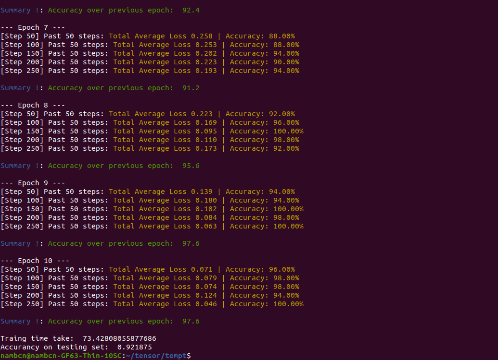

# A Convolution Neural Network (CNN) From Scratch
This project implements a simple CNN network with all basic Layer for a face classification like:
- Convolution2D (only support 3x3 kernel side).
- Maxpoolng (only support 2x2 pool size).
- Flatten
- Dense (Fully Connected).
- SoftMax.
Especially, The Convolution2D and Maxpoolng was designed to run by both way: Using the CPU and using the specialized desgined FPGA module. 

## Usage
This CNN network can be used both on Personal computer and Zynq7000 SOC device. Obviously, when running on PC, you can only use the "CPU"
functionality of Convolution2D and Maxpooling layer.

First, Install dependencies (Required both on PC and Zynq7000):

```bash
pip install numpy
pip install matplotlib
```
**Note: on Zynq7000, you may not be able to install numpy or matplotlib by pip package, try to find a prebuilt rootfs with numpy or matplotlib 
installed or add numpy package to rootfs by petalinux.

Next, if you just want to run by CPU, simply run with:

```bash
$ python test_cpu.py
```
In case you want to run convolution and maxpooling by FPGA mode, you first need to install a device driver for the Convolution and Maxpooling FPGA module, 
you could find the detailed instruction at my repository: https://github.com/TranNamCHY/Convolution_Driver.

**Note: if you got the error message like: "segmentation fault" when run the test, you may need to recompile the "matrix_ultility.c" by yourself, visit
my repository: https://github.com/TranNamCHY/Convolution_Driver for more detail

Then, run it with no arguments:

```bash
$ python test_fpga.py
```


## About CNN

The CNN network designed in two testbench has architecture: Con3x3(16 filters), Maxpooling2x2, Con3x3(16 filters), Maxpooling2x2, Flatten, Dense(16 neurons), Softmax.

Training set include 500 face image of 16 people classified into 16 label, each label represent a person. The CNN was trained to classify the face in input image to one of 16 label.

The testing set include 160 face image, each label has 10, used to evaluate the accurancy of the final model.



Because the traing algorithm is just gradient descent, the final accuracy of traing step barely reach to 100%. 
